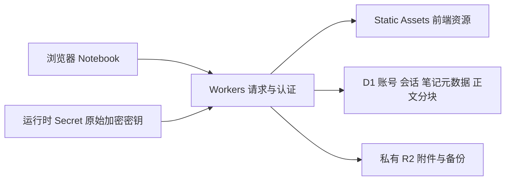

# Cloudflare 部署可行性与迁移方案

核查日期：2026-10-08。代码基线：v0.11.0 / `07abe12`。

## 结论

可以使用 Cloudflare，但当前仓库不是可直接发布的 Workers/Pages 应用。

- **要尽快通过域名和 HTTPS 使用现有工具：采用 Tunnel，保留现有 Docker 服务及数据。**
- **要关闭本地服务器后仍可使用：建议建设 Workers + Static Assets + D1 + R2 版本。** 前端继续复用，后端与存储需要适配和迁移。
- Containers 可以运行 Python 镜像，但容器本地磁盘不是持久卷，不能直接承载现有数据库、账号库和附件。因此上传当前 Dockerfile 不是完整部署方案。[官方说明](https://developers.cloudflare.com/containers/concepts/)

本次只完成代码与平台能力核查、文档整理和边界验证。未创建 Cloudflare 资源，未修改 DNS、现有容器、生产数据或加密密钥。

## 当前系统的部署依赖

| 部分 | 当前实现 | 迁移影响 |
| --- | --- | --- |
| UI / 编辑器 | `static/` 原生网页，本地打包 Markdown、公式、流程图编辑器 | 可复用，通过 Static Assets 分发；保留同源 API 和安全响应头 |
| HTTP / API | `server.py`，Python `ThreadingHTTPServer` | Workers 需要请求处理入口，不能沿用常驻监听服务 |
| 笔记数据 | `store.py` SQLite，或 `pgstore.py` PostgreSQL | D1 需要数据库适配、账号字段及事务/版本控制设计 |
| 账号与七天会话 | `auth.py` 独立 SQLite `auth.db` | 即使使用 PostgreSQL，认证库也仍依赖本地文件；必须单独迁移 |
| 多账号隔离 | 每账号独立 SQLite 目录，或 PostgreSQL schema | 共用 D1 时所有数据访问都必须带不可变账号 ID，不能仅按记录 ID 查询 |
| 附件 | 本地目录、账号分区、内容哈希文件名 | 改为私有 R2 对象；下载仍经过会话及归属检查 |
| 托管加密 | `storage_crypto.py`，AES-256-GCM，独立 32 字节密钥文件 | 迁移到运行时 Secret，保留原始密钥和密文格式兼容；浏览器不能获得密钥 |
| 备份与恢复 | SQLite 交换格式、ZIP / `.plbackup`、临时文件 | 需要单独适配大文件上传、解密、校验、恢复与一致性 |
| 图片 / PDF 导出 | 浏览器端渲染、下载或打印 | 可继续复用，无需在 Cloudflare 上运行 Python 或训练任务 |

Python Workers 使用 Pyodide，`threading` 不具备常规线程功能；文件系统为临时内存文件系统。不能据此推断现有 Python 服务可原样运行。[Python Workers 标准库](https://developers.cloudflare.com/workers/languages/python/stdlib/)

## 路线比较

| 路线 | 改动 | 本地服务器关机后可用 | 适合目标 |
| --- | --- | --- | --- |
| 仅上传前端到 Pages / Static Assets | 小，但缺少应用 API | 完整功能不可用 | 独立 UI 演示；不作为本工具正式部署 |
| Tunnel → 现有 Docker | 主要为域名、代理和 HTTPS 配置 | 否 | 快速提供远程访问，保留现有实现 |
| Workers + Static Assets + D1 + R2 | 后端移植、存储和数据迁移，改动较多 | 是 | 完全托管到 Cloudflare，作为推荐的云端目标 |
| Containers + 持久数据库 / 对象存储 | 可复用 Python，但认证与文件存储仍需适配 | 取决于所选持久服务 | 必须保留 Python 运行时的场景 |

Tunnel 是连接入口，不是应用和数据迁移。Cloudflare 官方描述它通过 `cloudflared` 从现有基础设施主动连接到 Cloudflare。[Tunnel 文档](https://developers.cloudflare.com/cloudflare-one/networks/connectors/cloudflare-tunnel/)

## 路线 A：保留服务器，通过 Tunnel 访问

结构：浏览器 HTTPS → Cloudflare → cloudflared → 现有应用 → 现有 PostgreSQL / 认证库 / 附件。

实施时需要：

1. 确定 Cloudflare 托管的域名和主机名，例如 `log.example.com`，创建指向现有应用的命名 Tunnel。
2. 保持原数据库、认证库、附件、全部账号数据区和原加密密钥挂载；`cloudflared` 本身不搬移数据。
3. 将浏览器实际使用的 `https://log.example.com` 加入 `PROCESS_LOG_ALLOWED_ORIGINS`，正确保留 Host，不放开通配来源。
4. 公网 HTTPS 部署使用 `PROCESS_LOG_AUTH_ENABLED=1`、`PROCESS_LOG_SESSION_DAYS=7`、`PROCESS_LOG_COOKIE_SECURE=1`。
5. 原实例若还需保留局域网 HTTP，不能只把全局 Secure Cookie 改为 1：那会使 HTTP 登录不再携带 Cookie。先决定统一使用 HTTPS，还是增加经过验证的独立 HTTPS 服务入口。不得为兼容公网而关闭认证。
6. 可信代理精确配置 `PROCESS_LOG_TRUSTED_PROXIES`；验证 `X-Forwarded-For` 的来源链，否则不同客户可能共用一个代理 IP 的登录限速。
7. 保留 API / 认证响应的 `Cache-Control: no-store`，不为私有数据或带会话的首页配置强制共享缓存。

从 IP 地址换到域名后，浏览器 Cookie、草稿和视图偏好属于不同来源；先保存旧页面，再在新域名登录。服务端账号和笔记不会因此消失。

验收包括：正确域名能登录、错误 Host/Origin 拒绝、未登录私有 API 为 401、跨账号无法访问附件、七天会话可持续、保存/导入/图片与 PDF 导出正常。保持原入口可回滚，验证完成后再决定是否收紧其网络访问。

Cloudflare 的上传限制也适用于代理入口。Free/Pro 当前单请求上限为 100 MB，业务应用已有的 250 MiB 恢复上限不意味着经 Tunnel 能上传同样大的文件。超限备份仍需受控的源站恢复通道，或实现分块上传。[请求体限制](https://developers.cloudflare.com/workers/platform/limits/)

## 路线 B：完全托管的目标架构

上图是迁移设计，不是本次已部署资源。[Static Assets](https://developers.cloudflare.com/workers/static-assets/)、[D1](https://developers.cloudflare.com/d1/)、[R2](https://developers.cloudflare.com/r2/) 提供相应平台能力。

### 前端与 API

- 沿用 `static/`，尽量保持现有 `/api/*` 请求、Markdown/CSV 数据结构、草稿机制及导出页面。
- Worker 在分发需登录的首页和导出页之前执行认证；公开 JS/CSS 可以分发，但不得将用户笔记或密钥放进静态资源。
- 请求头 `X-Process-Log-Account` 仍须与服务器会话中的账号数据区 ID 一致；错误账号、旧页面、过期会话行为与当前版本相符。

### 数据库与正文大小

D1 不是现有 `sqlite3.Connection` 的直接替代品，也不提供 PostgreSQL schema 的同样隔离方式。推荐共用 D1 存储账号和记录，用账号 ID 约束所有主键关联、查询、写入和附件归属，并保留乐观版本冲突及读快照语义。

D1 当前单字符串 / BLOB / 行大小限制为 **2,000,000 字节**。当前应用把整本笔记的单元格 JSON 加密并 Base64 编码后存入一个字段；接近正文上限时，不能保证满足 D1 限制。[D1 限制](https://developers.cloudflare.com/d1/platform/limits/)

本次用原 `StorageCipher` 和临时测试密钥验证：1,500,000 字节明文生成的字段为 **2,000,073 字节**，已经超限。历史恢复还允许更大的旧笔记，因此不能直接把 `notebooks.cells` 整列导入 D1。

推荐将正文密文按有上限的块存放，例如每块不超过 256 KiB，关联账号、记录和快照代次。更新必须让正文代次与记录版本一致提交；读取必须获取同一代次。先完成分块设计和边界测试，再迁移，不能静默截断现有正文。

### 账号、密码与加密

- 把管理员和普通账号、不可变 `storage_id`、密码盐/哈希及会话记录作为独立迁移对象。只导入笔记备份不能恢复普通账号与数据区的映射。
- 保持原 scrypt 参数和密码验证语义。Workers 的 `node:crypto` 文档支持除列出例外外的 API，但仍需在目标运行时验证当前参数的输出、CPU、内存和并发登录表现；不能仅凭 Node.js 本地测试宣布云端可用。[Node crypto 兼容性](https://developers.cloudflare.com/workers/runtime-apis/nodejs/crypto/)
- 将原始 32 字节存储密钥以受控 Secret 注入运行时，不写入仓库、前端或日志，不在部署时自动生成新密钥替换原密钥。
- 用测试向量核对旧 AES-GCM 信封、nonce、AAD、Base64 编码及损坏密文的拒绝行为。新密文格式若有变更，必须带版本并提供旧格式读取/迁移路径。
- HTTPS、HttpOnly / Secure / SameSite Cookie、七天有效期、退出/停用/改密码后的撤销均需回归。持久会话及撤销状态必须使用已验证一致性的存储路径。

### 附件、备份和迁移

- R2 保持私有，账号分区的对象 key 不代替访问控制；每次下载、预览和恢复都验证会话与对象归属。
- 不把 250 MiB 备份完整缓冲进 Worker。当前 Worker 内存上限为 128 MB；原后端整包 ZIP 和 AES-GCM 处理方式需要改变，或先提供经过验证的离线迁移工具。[Workers 限制](https://developers.cloudflare.com/workers/platform/limits/)
- 首版迁移工具在本地读取 PostgreSQL / SQLite、独立 auth.db、全部账号附件及原始密钥，生成可校验的云端导入数据；真实数据与密钥不进入 Git 或构建产物。
- 导入新环境后核对每账号项目、笔记、单元格及附件数量和内容摘要，再验证账号隔离、加密和备份恢复。
- 正式切换前停写并完成最后一次导入；保留原服务器及整站备份。首版不做双向写入，回滚需处理切换后的新增数据。

免费计划能否满足使用量需要实测。登录密码运算、加密、备份处理和数据库配额均可能影响选型；当前尚未运行 Workers 运行时测试，也未验证某个账户的计划或计费配置。

## 为什么不直接上传 Dockerfile

Containers 可以复用 CPython 和现有依赖，但本地磁盘是临时工作区。即使笔记已经连接 PostgreSQL，下列内容仍会丢失持久性：`auth.db`、账号目录、附件和恢复前快照。必须把这些存储改为外部持久服务；把 SQLite 文件周期性复制到 R2 不等价于事务数据库，也不能保障最新会话和正文写入。

此外 Containers 当前属于 Workers Paid 计划并有资源用量计费，不等价于静态站点免费托管。[Containers 存储说明](https://developers.cloudflare.com/containers/concepts/)、[Containers 计费](https://developers.cloudflare.com/containers/platform/pricing/)

## 下一阶段的交付顺序

1. 确定目标：只增加 HTTPS 公网入口，或完全解除本地服务器依赖。
2. 若选 Tunnel：准备域名、代理配置和备份，先做独立测试入口，再切正式域名。
3. 若选全托管：先完成 Worker 请求入口、D1 正文分块、R2 私有附件和 Secret 加密的最小验证；包含密码兼容及超限正文测试。
4. 通过后再移植全部 API、账号管理、冲突恢复、备份/恢复与导出，并迁移测试数据。
5. 完整功能和隔离测试通过后，才迁移真实数据并切换入口。

可行性核查不等同于完成适配或实际发布。当前 Linux Docker 部署仍是正式运行版本。
